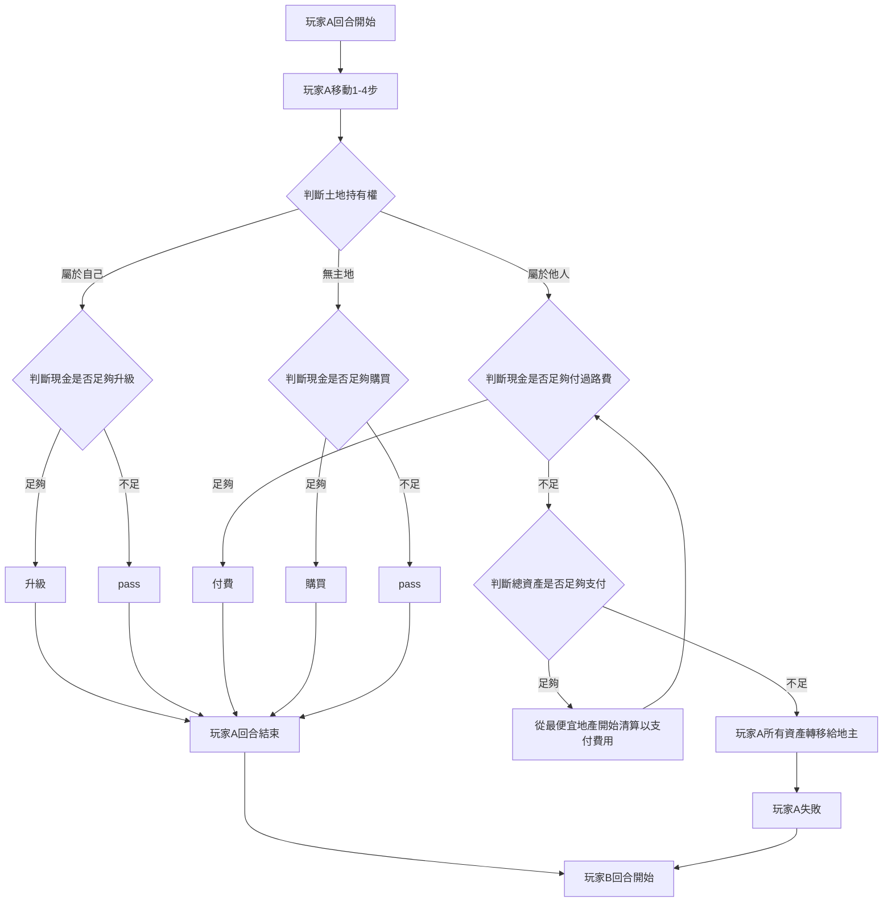

# Monopoly
*Traffic and Commercial Data Analytics Laboratory - First Programming Training Assignment*
 
 
 

# 題目

## 第一階段-遊戲參數與結果間關係的觀察
**練習資料呈現與異常狀況發現**
1. 設計一個大富翁遊戲，並說明 
  - 本遊戲的遊玩流程
  - 本遊戲內所有的可調參數
  - 本遊戲該考慮哪些因子以達到遊戲平衡
2. 實作該遊戲，其中該遊戲必須能全自動化進行
3. 執行該遊戲數千輪，探討每個可調參數對遊戲結果造成的影響，並討論你目前的可調參數是否有造成任何會影響遊戲平衡的異常狀況

## 第二階段-遊戲異常狀況的修正
**基本機器學習概念的體會**
1. 承第一階段，將遊戲的某參數故意改成不合理數值
2. 執行該遊戲數千輪，並探討該可調因子與遊戲結果的關係
3. 在完成第二步後，進行異常參數的自動調整來達到遊戲平衡。
 
 
 

# 遊戲單回合流程
每一輪每個玩家執行一回合，持續進行至僅剩一名玩家狀態為play

