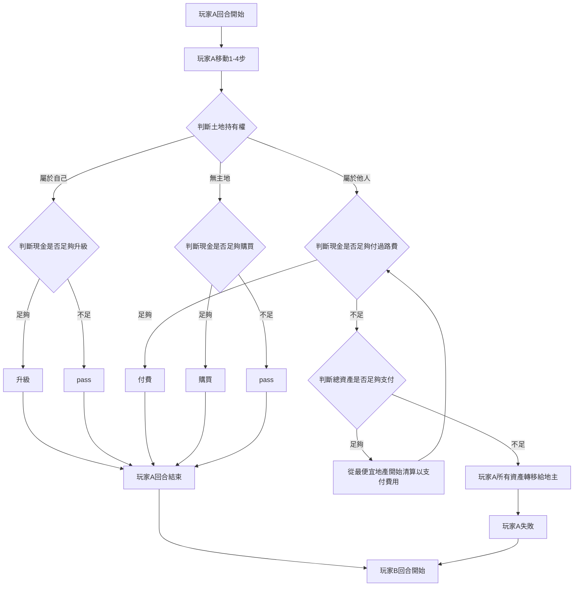

# Monopoly
*Traffic and Commercial Data Analytics Laboratory - First Programming Training Assignment*
 
### [PPT](https://docs.google.com/presentation/d/16AAIe4rSJtwenVXur8IXOz0qHh_0Hns0z_4yW9iteBI/edit?usp=sharing) 
 
 

# 題目

## 第一階段-遊戲參數與結果間關係的觀察
**練習資料呈現與異常狀況發現**
1. 設計一個大富翁遊戲，並說明 
  - 本遊戲的遊玩流程
  - 本遊戲內所有的可調參數
  - 本遊戲該考慮哪些因子以達到遊戲平衡
2. 實作該遊戲，其中該遊戲必須能全自動化進行
3. 執行該遊戲數千輪，探討每個可調參數對遊戲結果造成的影響，並討論你目前的可調參數是否有造成任何會影響遊戲平衡的異常狀況

## 第二階段-遊戲異常狀況的修正
**基本機器學習概念的體會**
1. 承第一階段，將遊戲的某參數故意改成不合理數值
2. 執行該遊戲數千輪，並探討該可調因子與遊戲結果的關係
3. 在完成第二步後，進行異常參數的自動調整來達到遊戲平衡。
 
 
 

# 第一階段
## 遊戲流程

流程程式碼: [Monopoly.py](https://github.com/jihshiann/Monopoly/blob/main/Monopoly/Monopoly.py)

### 流程大綱
1. 每個玩家輪流行動，單位為一回合，回合內執行動作可參考下方說明
2. 所有未破產玩家各執行一回合稱為一輪
3. 遊戲持續進行至，該輪僅剩一名玩家未破產為止，稱為一局

### 單一回合流程圖

 
 

## 參數
### 初始設定
- player: 

- land: 

### player可調參數
玩家人數共四位，人數不可調，每個玩家包含參數:
- money: 初始設定為100元，用以支付遊戲內所有花費
- location: 玩家所在位置，初始設定為0,4,8,12，對應至 **land.location**

### land可調參數
地圖總共15格，格數不可調整，每格土地包含參數:
- price: 無主地購買價，升級費用及過路費也受此參數影響，各地初始設定不盡相同
- level: 土地已升級次數，升級費用及過路費受此參數影響，初始設定為1且 _**不可調整**_

### 費率
影響各種費用之計算:
- toll: 過路費費率，初始設定為0.1。 計算方式為 price * rate * level
- upgrade: 升級費率，初始設定為0.5。 計算方式為 price * upgrade * level
 
 

## 影響因子
1. 上述可調參數
2. 可移動距離，設定為1-4
3. 玩家執行順序，設定為依照玩家id輪流
4. 現金足夠時，買/升級土地機率，設定為資產足夠則直接買地/升級(100%)
5. 現金不足清算方式，設定為從價值最低地產開始清算
 
 

## 全自動化遊戲
使用程式碼包含
1. [Monopoly.py](https://github.com/jihshiann/Monopoly/blob/main/Monopoly/Monopoly.py)
2. [Lib.py](https://github.com/jihshiann/Monopoly/blob/main/Monopoly/Lib.py)
3. [Tools.py](https://github.com/jihshiann/Monopoly/blob/main/Monopoly/Tools.py)
4. [config.ini](https://github.com/jihshiann/Monopoly/blob/main/Monopoly/config.ini)
 
 

## 可調參數之影響
### 預設參數執行結果(10000局)
統計及圖表繪製程式碼: [Analysis.py](https://github.com/jihshiann/Monopoly/blob/main/Monopoly/Analysis.py)
1. 勝率: [圖表](https://github.com/jihshiann/Monopoly/blob/main/Digram/default%20parameter/Win%20rate.png)
1. 各地數據統計: [圖表](https://github.com/jihshiann/Monopoly/blob/main/Digram/default%20parameter/Lands%20for%20game%20results.png)
1. 各地破產機率(每局): [圖表](https://github.com/jihshiann/Monopoly/blob/main/Digram/default%20parameter/Bankruptcy%20probability%20by%20location.png)
1. 各地無收入機率(每局):
1. 遊戲進行輪數: [圖表](https://github.com/jihshiann/Monopoly/blob/main/Digram/default%20parameter/Consumed%20Rounds%20Count.png)

 
